[](https://github.com/mollendorff-ai/sentinel/actions/workflows/ci.yml)
[](https://github.com/mollendorff-ai/sentinel/actions/workflows/ci.yml)
[](https://github.com/mollendorff-ai/sentinel/actions/workflows/ci.yml)
[](pyproject.toml)
[](LICENSE)

# Sentinel

**Autonomous earnings analysis powered by multi-agent AI.**

LangGraph agents fetch live earnings data, build financial models, run Monte Carlo simulations, and produce investment-grade analysis briefs -- with zero hallucinated numbers.

```mermaid
C4Container
    title Sentinel — C4 Container Diagram

    Person(analyst, "Analyst", "Requests earnings analysis via CLI")
    System_Ext(mcp_client, "MCP Clients", "Claude Code, Claude Desktop, other LLM agents")

    Container_Boundary(sentinel, "Sentinel") {
        Container(mcp_server, "MCP Server", "FastMCP / stdio", "sentinel_analyze + sentinel_resume — two-tool HITL flow")
        Container(pipeline, "LangGraph Pipeline", "StateGraph", "Conditional routing, self-correction loops, HITL approval gate, streaming, checkpointing")
        Container(research, "Research Agent", "LangChain", "Fetches earnings data, extracts financials")
        Container(retriever, "Retriever Agent", "LangChain", "Queries Qdrant for historical quarters, populates trend context")
        Container(modeler, "Modeler Agent", "LangChain", "Generates Forge YAML, validates, calculates DCF")
        Container(risk, "Risk Analyst", "LangChain", "Monte Carlo simulation, tornado sensitivity")
        Container(scenario, "Scenario Planner", "LangChain", "Bull / base / bear scenario analysis")
        Container(synth, "Synthesizer", "LangChain", "Executive brief with traceable numbers and trend analysis")
        ContainerDb(db, "SQLite", "Checkpointer", "Persists state for resumable runs")
        ContainerDb(qdrant, "Qdrant", "Vector Store", "Historical earnings embeddings for trend retrieval")
    }

    System(forge, "Forge", "Our MCP server: DCF, Monte Carlo, 173 Excel functions, 7 analytical engines")
    System(ref, "Ref", "Our MCP server: headless Chrome, SPA support, structured JSON extraction")
    System_Ext(llm, "LLM Provider", "Claude / GPT / Gemini — swappable via env var")
    System_Ext(langsmith, "LangSmith", "Observability: traces, run names, tags, metadata")

    Rel(analyst, pipeline, "Runs", "CLI / Makefile")
    Rel(mcp_client, mcp_server, "Calls tools", "MCP / stdio")
    Rel(mcp_server, pipeline, "Drives")
    Rel(pipeline, research, "Dispatches")
    Rel(pipeline, retriever, "Dispatches")
    Rel(pipeline, modeler, "Dispatches")
    Rel(pipeline, risk, "Full mode only")
    Rel(pipeline, scenario, "Full mode only")
    Rel(pipeline, synth, "Dispatches")
    Rel(research, ref, "Fetches earnings", "MCP / stdio")
    Rel(retriever, qdrant, "Queries history", "fastembed")
    Rel(modeler, forge, "Validate + calculate", "MCP / stdio")
    Rel(risk, forge, "Simulate + tornado", "MCP / stdio")
    Rel(scenario, forge, "Scenarios + compare", "MCP / stdio")
    Rel(research, llm, "Extracts financials", "API")
    Rel(modeler, llm, "Generates YAML", "API")
    Rel(risk, llm, "Augments model", "API")
    Rel(scenario, llm, "Generates scenarios", "API")
    Rel(synth, llm, "Produces brief", "API")
    Rel(pipeline, db, "Checkpoints state")
    Rel(pipeline, qdrant, "Ingests after run", "fastembed")
    Rel(pipeline, langsmith, "Traces runs", "HTTPS")

    UpdateLayoutConfig($c4ShapeInRow="3", $c4BoundaryInRow="1")
```



**AI reasons. Forge calculates. Every number is deterministic and traceable.**

## Ecosystem

Sentinel is part of the [mollendorff-ai](https://github.com/mollendorff-ai) platform. All three projects are designed to work together via [MCP](https://modelcontextprotocol.io/) (Model Context Protocol):

| Project | Role | Details |
| ------- | ---- | ------- |
| **[Sentinel](https://github.com/mollendorff-ai/sentinel)** | Multi-agent orchestrator | LangGraph pipeline: 6 agents, Qdrant RAG, HITL approval gate, streaming, conditional routing, self-correction, checkpointing. Also an MCP server (2 tools) |
| **[Forge](https://github.com/mollendorff-ai/forge)** | Financial modeling engine | MCP server: 20 tools, 173 Excel functions, 7 analytical engines (DCF, Monte Carlo, sensitivity) |
| **[Ref](https://github.com/mollendorff-ai/ref)** | Web data ingestion | MCP server: 6 tools, headless Chrome, SPA support, bot protection bypass, structured JSON |

Sentinel orchestrates. Forge calculates. Ref fetches. The LLM reasons -- and is swappable with one env var.

## Architecture

| Agent | Role | Tools |
| ----- | ---- | ----- |
| **Research** | Fetches earnings press release, extracts revenue, margins, guidance | Ref (MCP) |
| **Retriever** | Queries Qdrant for past quarters; populates historical context for trend analysis | Qdrant (fastembed) |
| **Modeler** | Writes Forge YAML model: 5-year DCF with assumptions from extracted data | Forge validate + calculate (MCP) |
| **Risk Analyst** | Adds Monte Carlo distributions to uncertain inputs, identifies top risk drivers | Forge simulate + tornado (MCP) |
| **Scenario Planner** | Generates bull/base/bear scenarios from guidance language, probability-weighted | Forge scenarios + compare (MCP) |
| **Synthesizer** | Produces executive summary: valuation range, risk factors, trend analysis, recommendation | Reads all Forge outputs + historical context |

The LangGraph pipeline handles routing, error recovery, and agent self-correction. In `--quick` mode, Risk Analyst and Scenario Planner are skipped via conditional edges. In `--hitl` mode, the pipeline pauses before the Synthesizer for analyst review — approve to generate the brief, or reject with feedback to rerun with context.

## Why This Design

LLMs hallucinate numbers. Sentinel enforces a clean boundary:

- **Any LLM does:** reasoning, extraction, synthesis, scenario narrative
- **Forge does:** DCF, NPV, IRR, Monte Carlo, sensitivity analysis, scenario math
- **Ref does:** live web data ingestion (headless Chrome, SPA support, bot protection bypass)

Swap the LLM provider with one env var (`SENTINEL_LLM_PROVIDER`). The orchestration layer doesn't care which model reasons -- only that Forge calculates.

The agent writes YAML. Forge validates the formulas. If the model is wrong, Forge returns errors and the agent self-corrects. No spreadsheet. No guessing.

## Stack

| Layer | Technology |
| ----- | ---------- |
| Orchestration | LangGraph (Python) -- [why Python?](docs/adr/001-python-over-typescript.md) |
| Persistence | SQLite checkpointer ([why?](docs/adr/007-sqlite-checkpointer.md)) |
| HITL | `interrupt_before` + checkpointer -- opt-in via `--hitl`; same mechanism drives the MCP server ([ADR-010](docs/adr/010-hitl-interrupt-before-synthesizer.md)) |
| MCP Server | FastMCP over stdio -- `sentinel_analyze` + `sentinel_resume` ([ADR-011](docs/adr/011-sentinel-as-mcp-server.md)) |
| Historical RAG | Qdrant + fastembed ([why?](docs/adr/009-qdrant-rag-historical-earnings.md)) -- local, zero API key |
| Observability | LangSmith (per-ticker run names, tags, metadata) |
| Financial modeling | [Forge](https://github.com/mollendorff-ai/forge) via MCP (20 tools, 173 Excel functions, 7 analytical engines) |
| Data ingestion | [Ref](https://github.com/mollendorff-ai/ref) via MCP (6 tools, headless Chrome, structured JSON) |
| LLM | Any LangChain-compatible model -- [swap with one env var](docs/adr/004-multi-provider-llm-support.md) |

## Roadmap

| Version | Summary | Status |
| ------- | ------- | ------ |
| v0.1.0 | Project scaffold, Forge MCP, Ref MCP | Shipped |
| v0.2.0 | 3-agent pipeline (Research, Modeler, Synthesizer) | Shipped |
| v0.3.0 | 5-agent pipeline, conditional routing, Monte Carlo | Shipped |
| v0.4.0 | Persistence, observability, multi-ticker batch, error handling | Shipped |
| v0.5.0 | C4 architecture diagram, dynamic badges, README showcase | Shipped |
| v0.6.0 | RAG with Qdrant -- historical earnings for trend analysis | Shipped |
| v0.7.0 | Human-in-the-loop approval gate, real-time streaming | Shipped |
| v0.8.0 | Sentinel as MCP server -- two-tool HITL flow for Claude Code / Desktop | Current |

See [CHANGELOG](CHANGELOG.md) for details.

## Getting Started

### Prerequisites

- Python 3.11+
- [Forge](https://github.com/mollendorff-ai/forge) v0.3.0+ (MCP server)
- [Ref](https://github.com/mollendorff-ai/ref) v1.5.0+ (MCP server)

### Install

```bash
git clone https://github.com/mollendorff-ai/sentinel.git
cd sentinel
make setup    # creates venv, installs deps, copies .env
# Edit .env with your API keys
```

### Run

```bash
make demo                        # Full 6-agent analysis for AAPL
make demo TICKER="AAPL MSFT"     # Multi-ticker batch mode
make demo-quick                  # Quick 3-agent mode (skip risk + scenarios)
python -m sentinel --hitl AAPL   # Full analysis with analyst approval gate
make check                       # Lint + test (100% coverage required)
```

Results are saved to `output/{TICKER}/{timestamp}/` with JSON, markdown, and YAML artifacts.

## MCP Server

Sentinel exposes itself as an MCP server over stdio, consistent with Forge and Ref.
Two tools implement the HITL flow from v0.7.0 ([ADR-011](docs/adr/011-sentinel-as-mcp-server.md)):

| Tool | Description |
| ---- | ----------- |
| `sentinel_analyze` | Run the full pipeline to the analyst approval gate. Returns `thread_id` + draft snapshot. |
| `sentinel_resume` | Resume from checkpoint. Pass `decision="approve"` or `"reject"` with optional `feedback`. Returns final brief. |

### Quick start

Add to your MCP client configuration (e.g. `~/.claude/mcp.json`):

```json
{
  "mcpServers": {
    "sentinel": {
      "command": "python",
      "args": ["-m", "sentinel", "mcp"],
      "cwd": "/path/to/sentinel"
    }
  }
}
```

Then in Claude Code or Claude Desktop:

1. Call `sentinel_analyze` with a ticker to get back `thread_id` and draft financials
2. Review the draft (risk ranges, scenario projections, historical trend)
3. Call `sentinel_resume` with `thread_id` + `decision="approve"` to get the final brief

## License

[MIT](LICENSE)
