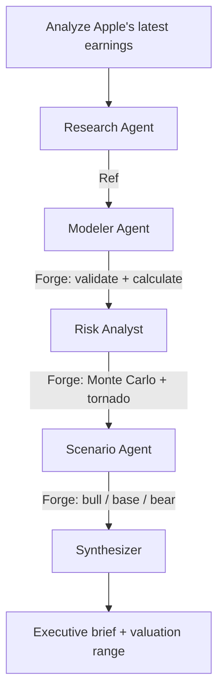

# Sentinel

**Autonomous earnings analysis powered by multi-agent AI.**

LangGraph agents fetch live earnings data, build financial models, run Monte Carlo simulations, and produce investment-grade analysis briefs — with zero hallucinated numbers.



**AI reasons. Forge calculates. Every number is deterministic and traceable.**

## Architecture

| Agent | Role | Tools |
| ----- | ---- | ----- |
| **Research** | Fetches earnings press release, extracts revenue, margins, guidance | [Ref](https://github.com/mollendorff-ai/ref) |
| **Modeler** | Writes Forge YAML model: 5-year DCF with assumptions from extracted data | [Forge](https://github.com/mollendorff-ai/forge) validate + calculate |
| **Risk Analyst** | Adds Monte Carlo distributions to uncertain inputs, identifies top risk drivers | Forge simulate + tornado |
| **Scenario Planner** | Generates bull/base/bear scenarios from guidance language, probability-weighted | Forge scenarios + compare |
| **Synthesizer** | Produces executive summary: valuation range, risk factors, recommendation | Reads all Forge outputs |
| **Supervisor** | LangGraph orchestrator: routing, error handling, agent self-correction | LangGraph state machine |

## Why This Design

LLMs hallucinate numbers. Sentinel enforces a clean boundary:

- **AI does:** reasoning, extraction, synthesis, scenario narrative
- **Forge does:** DCF, NPV, IRR, Monte Carlo, sensitivity analysis, scenario math
- **Ref does:** live web data ingestion (headless Chrome, SPA support, bot protection bypass)

The agent writes YAML. Forge validates the formulas. If the model is wrong, Forge returns errors and the agent self-corrects. No spreadsheet. No guessing.

## Stack

| Layer | Technology |
| ----- | ---------- |
| Orchestration | LangGraph (Python) — [why Python?](docs/adr/001-python-over-typescript.md) |
| Tracing | LangSmith |
| Financial modeling | [Forge](https://github.com/mollendorff-ai/forge) via MCP (10 tools, 173 Excel functions, 7 analytical engines) |
| Data ingestion | [Ref](https://github.com/mollendorff-ai/ref) (Rust CLI, headless Chrome, structured JSON) |
| LLM | Claude / GPT (model-agnostic) |

## Quick Start

```bash
# Prerequisites: forge and ref installed, Python 3.11+
pip install -e .
python -m sentinel "AAPL"
```

## Status

Under construction.

## License

[MIT](LICENSE)
