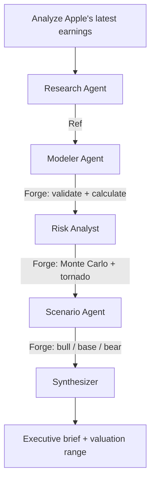

[](https://github.com/mollendorff-ai/sentinel/actions/workflows/ci.yml)
[](pyproject.toml)
[](pyproject.toml)
[](LICENSE)

# Sentinel

**Autonomous earnings analysis powered by multi-agent AI.**

LangGraph agents fetch live earnings data, build financial models, run Monte Carlo simulations, and produce investment-grade analysis briefs — with zero hallucinated numbers.



**AI reasons. Forge calculates. Every number is deterministic and traceable.**

## Architecture

| Agent | Role | Tools |
| ----- | ---- | ----- |
| **Research** | Fetches earnings press release, extracts revenue, margins, guidance | [Ref](https://github.com/mollendorff-ai/ref) |
| **Modeler** | Writes Forge YAML model: 5-year DCF with assumptions from extracted data | [Forge](https://github.com/mollendorff-ai/forge) validate + calculate |
| **Risk Analyst** | Adds Monte Carlo distributions to uncertain inputs, identifies top risk drivers | Forge simulate + tornado |
| **Scenario Planner** | Generates bull/base/bear scenarios from guidance language, probability-weighted | Forge scenarios + compare |
| **Synthesizer** | Produces executive summary: valuation range, risk factors, recommendation | Reads all Forge outputs |
| **Supervisor** | LangGraph orchestrator: routing, error handling, agent self-correction | LangGraph state machine |

## Why This Design

LLMs hallucinate numbers. Sentinel enforces a clean boundary:

- **Any LLM does:** reasoning, extraction, synthesis, scenario narrative
- **Forge does:** DCF, NPV, IRR, Monte Carlo, sensitivity analysis, scenario math
- **Ref does:** live web data ingestion (headless Chrome, SPA support, bot protection bypass)

Swap the LLM provider with one env var (`SENTINEL_LLM_PROVIDER`). The orchestration layer doesn't care which model reasons -- only that Forge calculates.

The agent writes YAML. Forge validates the formulas. If the model is wrong, Forge returns errors and the agent self-corrects. No spreadsheet. No guessing.

## Stack

| Layer | Technology |
| ----- | ---------- |
| Orchestration | LangGraph (Python) — [why Python?](docs/adr/001-python-over-typescript.md) |
| Tracing | LangSmith |
| Financial modeling | [Forge](https://github.com/mollendorff-ai/forge) via MCP (20 tools, 173 Excel functions, 7 analytical engines) |
| Data ingestion | [Ref](https://github.com/mollendorff-ai/ref) via MCP (6 tools, headless Chrome, structured JSON) |
| LLM | Any LangChain-compatible model — [swap with one env var](docs/adr/004-multi-provider-llm-support.md) |

## Getting Started

### Prerequisites

- Python 3.11+
- [Forge](https://github.com/mollendorff-ai/forge) v0.3.0+ (MCP server)
- [Ref](https://github.com/mollendorff-ai/ref) v1.5.0+ (MCP server)

### Install

```bash
# Clone and install in editable mode
git clone https://github.com/mollendorff-ai/sentinel.git
cd sentinel
python -m venv .venv && source .venv/bin/activate
pip install -e ".[dev]"

# Configure environment
cp .env.example .env
# Edit .env with your API keys
```

### Run tests

```bash
pytest
```

## Status

**v0.3.0** -- Full 5-agent pipeline (Research -> Modeler -> Risk Analyst -> Scenario Planner -> Synthesizer). Monte Carlo, tornado sensitivity, bull/base/bear scenarios. `--quick` flag for fast 3-agent mode. Default LLM: Opus 4.6. 77 tests, 100% coverage.

Next: **v0.4.0** -- Persistence + observability + polish.

See [CHANGELOG](CHANGELOG.md) and [roadmap](.asimov/roadmap.yaml) for details.

## License

[MIT](LICENSE)
